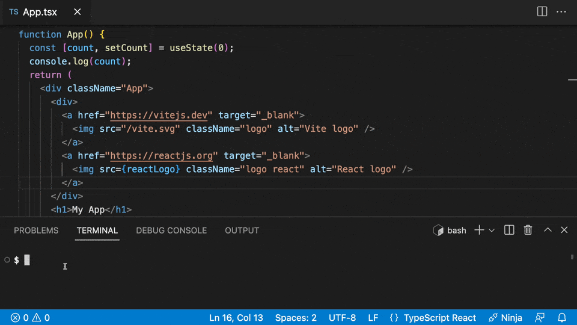
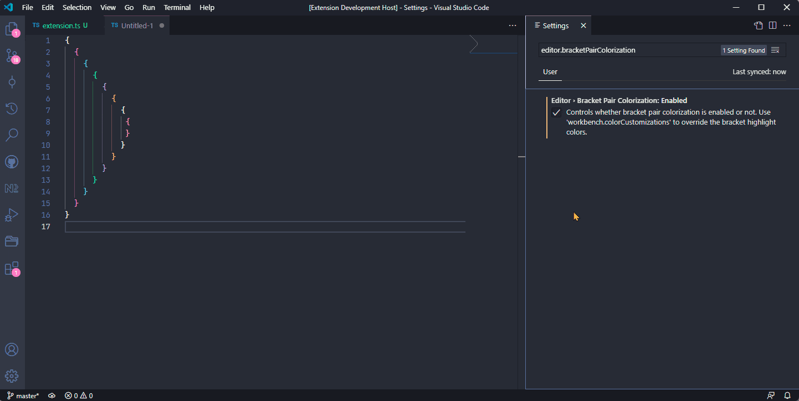
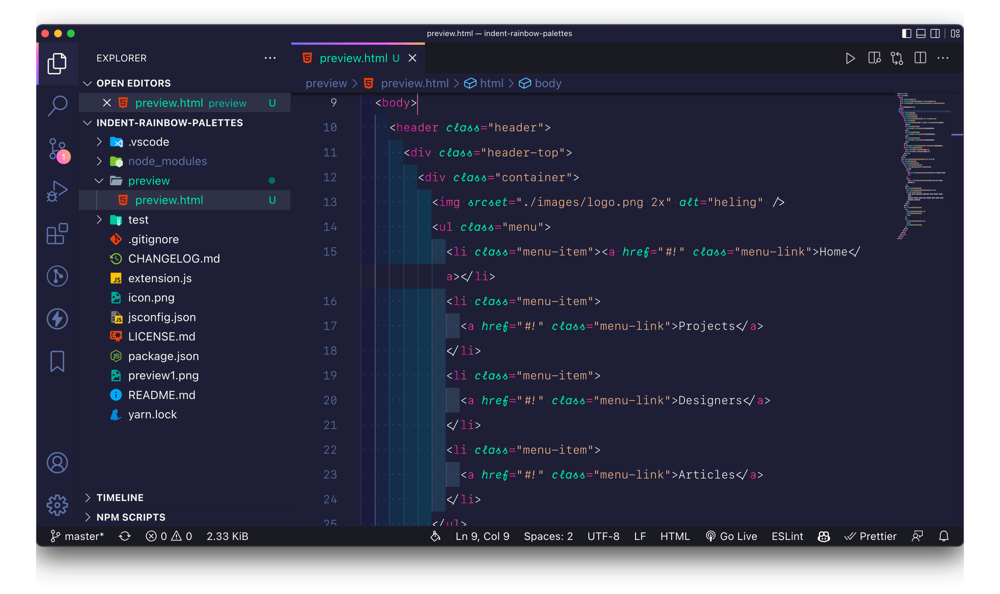
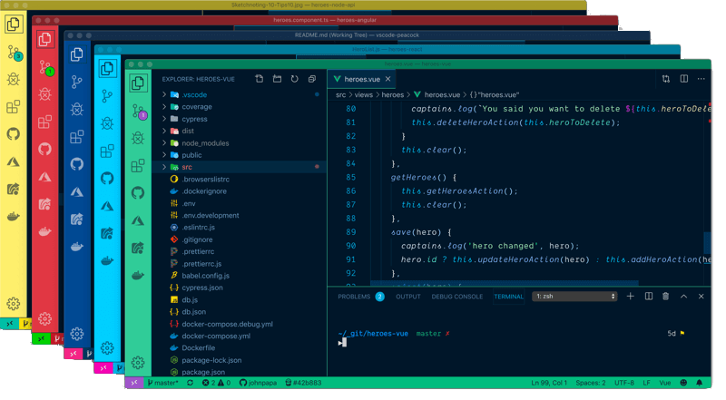
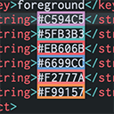

Welcome to my first blog!

After much contemplation and deliberation, I've decided to kickstart this blog with content that can prove beneficial to fellow developers. Please note that the tools and extensions mentioned here are presented in no particular order of importance or priority.

> The majority of the content in this blog has been composed or enhanced with the assistance of Chat-GPT, often guided by initial text snippets or prompts. Admittedly, I'm not a fan of writing myself! 😅

## 1. Code Spell Checker and Prettier - Code formatter

Need I say more? These two extensions are an absolute necessity for every developer to ensure proper standardized code formatting and spelling.

[Prettier](https://marketplace.visualstudio.com/items?itemName=esbenp.prettier-vscode) is a code formatter that ensures consistent and clean code styling across your projects. With Prettier, you no longer need to spend time manually aligning code or fixing indentation issues. It automatically formats your code as you type, saving you valuable development time and ensuring code uniformity among team members.

Typos and spelling errors can sneak into your code, leading to unexpected bugs and issues. [Code Spell Checker](https://marketplace.visualstudio.com/items?itemName=streetsidesoftware.code-spell-checker) is a helpful extension that scans your code for spelling mistakes and provides suggestions for corrections. This ensures that your code is not only error-free but also maintains a professional and polished appearance.

### Additional formatters:

- [isort (Python import sorter)](https://marketplace.visualstudio.com/items?itemName=ms-python.isort)

- [Sort JSON objects](https://marketplace.visualstudio.com/items?itemName=richie5um2.vscode-sort-json)

- [Sort lines](https://marketplace.visualstudio.com/items?itemName=Tyriar.sort-lines)

## 2. GitLens

[GitLens](https://marketplace.visualstudio.com/items?itemName=eamodio.gitlens) is a must-have extension for Visual Studio Code that takes your Git experience to the next level:

- **Rich Git Insights**: Gain real-time insights into your Git repositories, including commit history and authorship details, directly in your code.

- **Time Travel**: Effortlessly navigate commit histories, explore changes made over time, and understand code evolution.

- **Interactive Rebase**: Streamline your Git workflow with interactive rebase support, allowing you to easily reorder, edit, and squash commits, enhancing code history management.

- **Code Annotations**: See commit and blame annotations within your code, providing context for code changes and collaboration.

- **Code Lens Integration**: Seamlessly integrates with Code Lens for Git blame, history, and more.

- **Efficient Code Reviews**: Simplify code reviews with pull request and issue links, enhancing team collaboration.

With GitLens, you not only gain comprehensive insights into your Git repositories but also improve code history management through interactive rebasing. It's an indispensable tool for developers looking to enhance their Git workflow within Visual Studio Code.

### GitLens Graph Alternative: Git Graph

[Git Graph](https://marketplace.visualstudio.com/items?itemName=mhutchie.git-graph) is an excellent free alternative for visualizing your repository's commit history.

- **Intuitive Commit Graph**: Provides a clear and interactive visualization of your Git repository, making it easy to track branches, merges, and commits.
- **User-Friendly Interface**: Navigate through your repository with ease, thanks to its straightforward and responsive design.
- **Feature-Rich**: Supports all essential Git operations directly from the commit graph, including commit details, branch creation, and more.

Git Graph is a valuable tool for developers seeking a free and efficient way to manage and visualize their Git repositories within Visual Studio Code.

## 3. Console Ninja and Error Lens



[Console Ninja](https://marketplace.visualstudio.com/items?itemName=WallabyJs.console-ninja) displays console.log output and runtime errors directly in your editor from your running browser or node application. It brings clarity to your debugging process, making it easier to identify and address issues in your code.

[Error Lens](https://marketplace.visualstudio.com/items?itemName=usernamehw.errorlens) is your ally in detecting and resolving errors within your codebase. It highlights problematic lines, such as compiler errors or warnings, directly in your code. With Error Lens, you can swiftly spot issues and take corrective actions, ensuring cleaner, error-free code.
GitLens enhances code understanding and collaboration, making it essential for Git-based projects in Visual Studio Code.

## 4. Ai Code Assistant

AI code assistants have become indispensable tools for developers, offering advanced coding assistance and productivity boosts. Here, we explore four prominent AI code assistants:

- [Chat-GPT](https://chatgpt.com/)

- [GitHub Copilot](https://github.com/features/copilot/)

- [TabNine](https://www.tabnine.com/)

- [IntelliCode](https://visualstudio.microsoft.com/services/intellicode/).

## 5. Bracket Pair Colorization Toggler and Indent Rainbow





Gone are the days of struggling to decipher your code's indentation and bracket pairings. Thanks to [Bracket Pair Colorization Toggler](https://marketplace.visualstudio.com/items?itemName=dzhavat.bracket-pair-toggler), you can now effortlessly identify matching brackets. Additionally, [Indent Rainbow](https://marketplace.visualstudio.com/items?itemName=oderwat.indent-rainbow) provides clear visual cues for your current indentation level. These extensions simplify code comprehension and enhance your coding experience.

### Add-ons:

- [Evondev - Indent Rainbow Palettes](https://marketplace.visualstudio.com/items?itemName=evondev.indent-rainbow-palettes)

## 6. Peacock



If you've ever juggled multiple repositories in Visual Studio Code and found yourself perplexed by which window belongs to which project, [Peacock](https://marketplace.visualstudio.com/items?itemName=johnpapa.vscode-peacock) comes to the rescue. This extension allows you to personalize the color of each Visual Studio Code window, making it effortless to distinguish them by their distinct hues. Say goodbye to confusion and streamline your workflow by quickly identifying and navigating your projects with ease, all thanks to Peacock.

## 7. Auto Close Tag and Auto Rename Tag

[Auto Close Tag](https://marketplace.visualstudio.com/items?itemName=formulahendry.auto-close-tag) and [Auto Rename Tag](https://marketplace.visualstudio.com/items?itemName=formulahendry.auto-rename-tag) are invaluable extensions that streamline the development process by simplifying tag creation and renaming. They prove especially helpful when dealing with renaming tags separated by extensive lines of code.

One minor inconvenience with Auto Close Tag is that it generates the closing tag next to the opening tag when creating a new one. This causes a slight disturbance when you want to wrap a portion of text in a new tag. You will need to manually relocate it to the desired position at the end of your content.

For example:

```HTML
<p>
  Below are the text that I want to wrap in a bold tag:
  ---example text to be wrapped in a bold tag---
</p>
```

```HTML
<p>
  Below are the text that I want to wrap in a bold tag:
  <b></b><= closing b tag automatically generated and needs to be
  manually moved
</p>
```

## 8. Color Highlight



[Color Highlight](https://marketplace.visualstudio.com/items?itemName=naumovs.color-highlight) is a small convenient extension that simplifies color management in your code. It automatically detects and highlights color codes in CSS, SASS, LESS, and more, providing real-time color previews.

## 9. Themes and Icons

A visually appealing and customized editor can make a significant difference in your coding experience. Two of my favorite themes are:

- [Tokyo Night](https://marketplace.visualstudio.com/items?itemName=enkia.tokyo-night) offers a soothing dark blue palette that's easy on the eyes.

- [Dracula](https://marketplace.visualstudio.com/items?itemName=dracula-theme.theme-dracula) provides a striking contrast with vibrant colors.

Icons play a crucial role in identifying files and enhancing the look of your workspace.

- [Material Icon Theme](https://marketplace.visualstudio.com/items?itemName=PKief.material-icon-theme) is my go-to choice for file icons, bringing a clean and modern look to your file explorer.

- [Fluent Icon](https://marketplace.visualstudio.com/items?itemName=miguelsolorio.fluent-icons) offers a sleek and consistent icon set inspired by Microsoft's Fluent Design System for Visual Studio Code sidebar.

Customizing fonts can further personalize your coding environment. One fantastic option is [FiraCode iScript](https://github.com/kencrocken/FiraCodeiScript), which combines the popular Fira Code font with cursive italics for a unique and stylish look. If you need help setting up the font, this [tutorial video](https://www.youtube.com/watch?v=PQYdXwJJq-c) provides a step-by-step guide.
