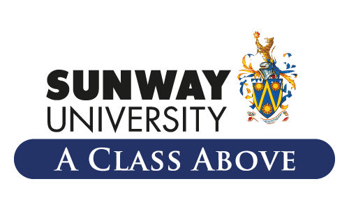
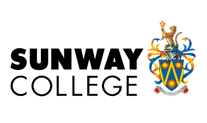

## Experience

<table>
    <thead>
        <tr>
            <th>Company</th>
            <th>Link</th>
            <th>Role</th>
            <th>Dates</th>
            <th>Description</th>
        </tr>
    </thead>
    <tbody>
        <tr>
          <td>
            
          </td>
          <td>
            <a href="https://xspectechnology.com/" target="_blank">
              Xspec Technology Sdn Bhd
            </a>
          </td>
          <td>Web Developer</td>
          <td>Jun 2023 - Present</td>
          <td>
            <ul>
              <li>
                Developed <a href="http://polygraph.my/" target="_blank">company website</a> to showcase services and products
              </li>
              <li>
                Led UI/UX design, content creation, and website development
              </li>
              <li>
                Collaborated closely with CEO to define layout and content strategies
              </li>
            </ul>
          </td>
        </tr>
        <tr>
          <td>
            
          </td>
          <td>
            <a href="https://www.mulahrewards.com/" target="_blank">
              Mulah Rewards Sdn Bhd
            </a>
          </td>
          <td>Software Engineer Intern</td>
          <td>Dec 2022 - Mar 2023</td>
          <td>
            <ul>
              <li>
                Worked as a software engineer for a <a href="https://mulahpoints.com/" target="_blank">web-based application</a>
              </li>
              <li>
                Implement features on both the internal application and customer application
              </li>
              <li>
                Collaborated closely with the product manager to review, define, and implement tasks
              </li>
              <li>
                Revamped customer application's website in alignment with provided UI design
              </li>
            </ul>
          </td>
        </tr>
    </tbody>
</table>

---

## Education

<table>
    <thead>
        <tr>
            <th>School</th>
            <th>Link</th>
            <th>Degree</th>
            <th>Date</th>
            <th>Grade</th>
        </tr>
    </thead>
    <tbody>
        <tr>
            <td></td>
            <td><a href="https://sunwayuniversity.edu.my/" target="_blank">Sunway University</a></td>
            <td>BSc (Hons) in Computer Science</td>
            <td>2023</td>
            <td>CGPA: 3.52</td>
        </tr>
        <tr>
            <td></td>
            <td><a href="https://sunwaycollege.edu.my/" target="_blank">Sunway College</a></td>
            <td>Canadian International Matriculation Program (CIMP)</td>
            <td>2019</td>
            <td>Average: 90%</td>
        </tr>
    </tbody>
</table>

---

## Awards

<table>
  <thead>
    <th>Association</th>
    <th>Title</th>
    <th>Details</th>
    <th>Date</th>
  </thead>
  <tr>
    <td></td>
    <td>3x Jeffrey Cheah Ace Scholarship</td>
    <td>
      Awarded for:
      <ul>
        <li>Maintaining a CGPA of 3.50 and above.</li>
        <li>Scoring a minimum average grade of 90% in CIMP</li>
      </ul>
    </td>
    <td></td>
  </tr>
  <tr>
    <td></td>
    <td>CIMP Academic Medal of Distinction</td>
    <td>Obtained an average of at least 90% in Canadian International Matriculation Program.</td>
    <td>2019</td>
  </tr>
  <tr>
    <td></td>
    <td>Merite scolaire de l'Ontario (Ontario Scholar)</td>
    <td>Obtained an average of at least 80% in Canadian International Matriculation Program.</td>
    <td>2019</td>
  </tr>
  <tr>
    <td></td>
    <td>Jeffrey Cheah Entrance Scholarship 2018</td>
    <td>Awarded for having 5 or more A/A+ in IGCSE</td>
    <td>2018</td>
  </tr>
</table>
